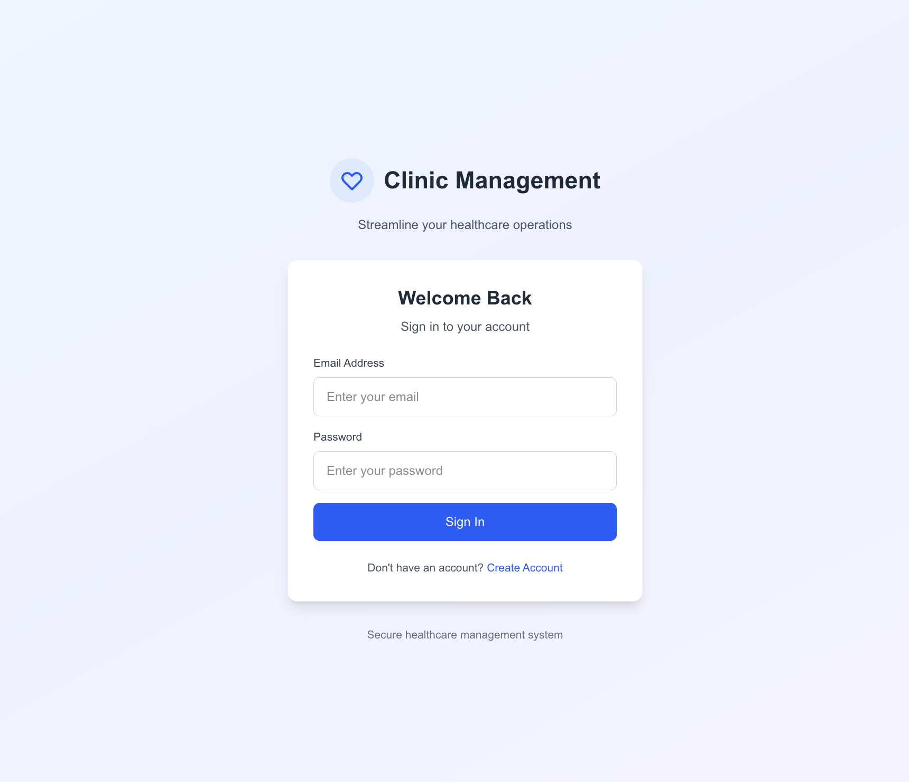
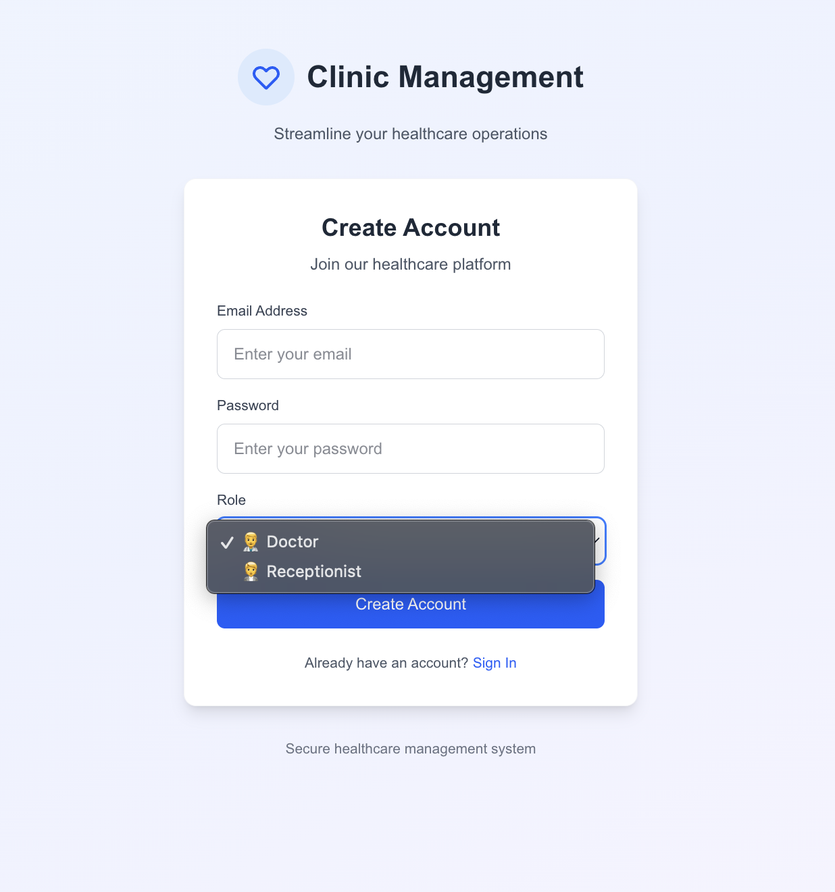
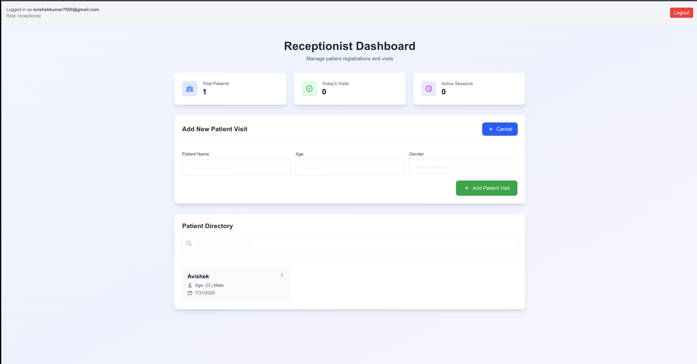
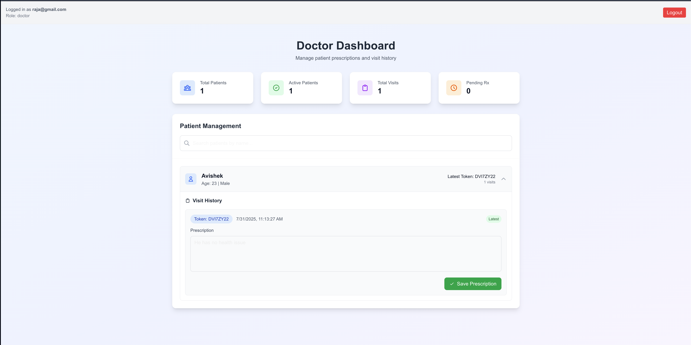
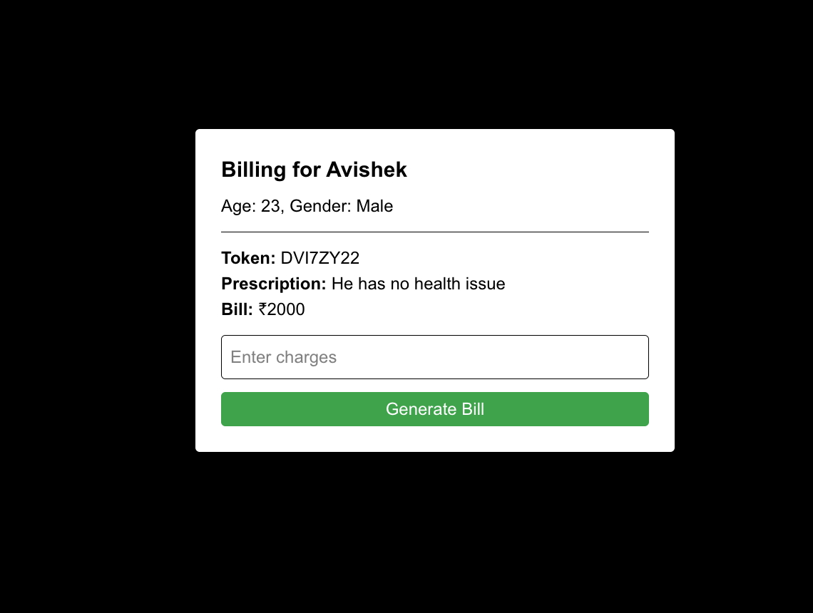

# 📘 Clinic Management System

A comprehensive web-based clinic management system built using Next.js, TypeScript, and Firebase. The system supports role-based logins for doctors and receptionists, enabling streamlined patient visit tracking, prescription management, and billing.

## 🎯 Project Overview

**Project Title:** Clinic Management System  
**Technologies:** Next.js, TypeScript, Firebase, Tailwind CSS  
**Domain:** Healthcare  
**Project Difficulty Level:** Medium  

## 🛠️ Technologies Used

- **Frontend:** React (Next.js with App Router), TypeScript, Tailwind CSS
- **Backend/Database:** Firebase Firestore
- **Authentication:** Firebase Authentication
- **Hosting:** Firebase Hosting (optional)
- **Logging:** Firestore + Custom Logger Utility
- **Testing:** Jest, React Testing Library

## 🚀 Features

### 👨‍⚕️ Doctor Dashboard
- View all patients with visit history
- See visit history per patient with expandable details
- View and edit prescriptions per visit
- View visit tokens and timestamps
- Search patients by name
- Real-time statistics dashboard

### 🧑‍💼 Receptionist Dashboard
- Add new patients with automatic token generation
- Generate unique token for each visit
- Add new visit automatically on duplicate patient
- View patient list and search by name
- Navigate to billing for each patient
- Real-time statistics dashboard

### 📄 Patient Visit History
- Shows all visits with:
  - Token
  - Date & time
  - Editable prescription field
  - Billing information

### 🧾 Billing System
- Add billing information (amount)
- Bill is linked to each visit
- Stored with timestamp
- Professional billing interface

### 🔐 Role-Based Access
- Authenticated login for doctors and receptionists
- Protected routes via useAuthGuard() hook
- Secure role-based permissions

## 📸 Screenshots

### Login Interface

*Secure authentication with role-based access for doctors and receptionists*

### User Registration

*Registration form for new doctors and receptionists with role selection*

### Receptionist Dashboard

*Patient management interface with visit registration and token generation*

### Doctor Dashboard

*Patient consultation interface with prescription management capabilities*

### Billing System

*Comprehensive billing system with automated service tracking*

## 📁 Firestore Database Structure

```
patients (collection)
│
├── {patientId} (document)
│   ├── name, age, gender
│   └── visits (subcollection)
│       ├── {visitId}
│           ├── token
│           ├── createdAt
│           ├── prescription
│           └── billing

logs (collection)
│
├── {logId} (document)
│   ├── uid, email
│   ├── action, message
│   ├── patientId, userRole
│   ├── timestamp, severity
│   └── additionalData

users (collection)
│
├── {userId} (document)
│   ├── email, role
│   └── createdAt
```

## 🧪 Testing

### Automated Testing
```bash
# Run all tests
npm test

# Run tests in watch mode
npm run test:watch

# Run tests with coverage
npm run test:coverage
```

### Test Coverage
- **Logger Utility Tests:** Comprehensive logging functionality tests
- **Auth Guard Tests:** Authentication and authorization tests
- **Component Tests:** UI component behavior tests
- **Integration Tests:** End-to-end workflow tests

### Manual Test Scenarios
1. Login as receptionist, add new patient, verify patient appears
2. Add patient with existing name → adds new visit
3. Login as doctor → edit prescription for any visit
4. Check bill generation and logging
5. Visit history shows all previous tokens and timestamps

## ⚙️ Getting Started

### Prerequisites
- Node.js 18+ 
- npm or yarn
- Firebase project

### Installation

1. **Clone the repository**
   ```bash
   git clone https://github.com/Avishek-7/Clinic_management_system
   cd Clinic_management_system
   ```

2. **Install dependencies**
   ```bash
   npm install
   ```

3. **Set up Firebase**
   - Create a Firebase project at [Firebase Console](https://console.firebase.google.com/)
   - Enable Authentication and Firestore
   - Add your Firebase config to `/src/lib/firebase.ts`:

   ```typescript
   const firebaseConfig = {
     apiKey: 'YOUR_API_KEY',
     authDomain: 'YOUR_PROJECT_ID.firebaseapp.com',
     projectId: 'YOUR_PROJECT_ID',
     storageBucket: 'YOUR_PROJECT_ID.appspot.com',
     messagingSenderId: 'YOUR_SENDER_ID',
     appId: 'YOUR_APP_ID'
   }
   ```

4. **Set up Firestore Security Rules**
   ```javascript
   rules_version = '2';
   service cloud.firestore {
     match /databases/{database}/documents {
       // Allow authenticated users to read/write their own data
       match /users/{userId} {
         allow read, write: if request.auth != null && request.auth.uid == userId;
       }
       
       // Allow authenticated users to read/write patients and visits
       match /patients/{patientId} {
         allow read, write: if request.auth != null;
         match /visits/{visitId} {
           allow read, write: if request.auth != null;
         }
       }
       
       // Allow authenticated users to read/write logs
       match /logs/{logId} {
         allow read, write: if request.auth != null;
       }
     }
   }
   ```

5. **Run the development server**
   ```bash
   npm run dev
   ```
   Visit [http://localhost:3000](http://localhost:3000)

## 📦 Project Structure

```
src/
├── app/
│   ├── doctor/           → Doctor dashboard
│   ├── receptionist/     → Receptionist dashboard
│   ├── billing/[id]/     → Billing per patient
│   ├── login/            → Login UI
│   └── components/       → Shared UI components
├── lib/
│   ├── firebase.ts       → Firebase configuration
│   └── hooks/            → Custom hooks
├── utils/
│   ├── authGuard.tsx     → Authentication guard
│   ├── logger.ts         → Logging utility
│   └── firebaseFailSafe.ts → Firebase error handling
├── __tests__/            → Test files
└── screenshots/          → Application screenshots
    ├── login-interface.png
    ├── registration.png
    ├── receptionist-dashboard.png
    ├── doctor-dashboard.png
    └── billing.png
```

## 🔧 Development

### Code Quality
- **ESLint:** Code linting and formatting
- **TypeScript:** Type safety and better development experience
- **Prettier:** Code formatting (optional)

### Logging System
The system includes comprehensive logging for all actions:
- Patient visit creation
- Prescription updates
- Bill generation
- User authentication
- Error tracking

### Error Handling
- Firebase connection failures
- Authentication errors
- Data validation
- Network issues

## 🚀 Deployment

### Firebase Hosting
```bash
# Build the project
npm run build

# Deploy to Firebase
firebase deploy
```

### Environment Variables
Create a `.env.local` file:
```env
NEXT_PUBLIC_FIREBASE_API_KEY=your_api_key
NEXT_PUBLIC_FIREBASE_AUTH_DOMAIN=your_auth_domain
NEXT_PUBLIC_FIREBASE_PROJECT_ID=your_project_id
```

## 📊 System Architecture

### Frontend Architecture
- **Next.js App Router:** Modern React framework
- **TypeScript:** Type safety and better DX
- **Tailwind CSS:** Utility-first CSS framework
- **Component-based:** Reusable UI components

### Backend Architecture
- **Firebase Firestore:** NoSQL database
- **Firebase Auth:** Authentication service
- **Real-time updates:** Live data synchronization
- **Offline support:** Progressive web app capabilities

### Security Features
- **Role-based access control**
- **Firestore security rules**
- **Authentication guards**
- **Input validation**

## 🎯 Project Evaluation Metrics

### Code Quality ✅
- **Modular:** Well-structured with separate components
- **Safe:** Firebase security rules and authentication
- **Testable:** Comprehensive test coverage
- **Maintainable:** TypeScript, proper file structure
- **Portable:** Works across different environments

### Database ✅
- **Firebase Firestore:** Scalable NoSQL database
- **Real-time synchronization**
- **Offline support**
- **Security rules implemented**

### Logging ✅
- **Comprehensive logging system**
- **Action tracking for all operations**
- **Error logging with stack traces**
- **User activity monitoring**

### Deployment ✅
- **Firebase Hosting ready**
- **Environment configuration**
- **Build optimization**
- **Performance monitoring**

## 📄 License

This project is licensed under the MIT License.

## 👤 Author

**Avishek Kumar**  
🔗 [github.com/Avishek-7](https://github.com/Avishek-7)  
📧 [avishekkumar7550@gmail.com](mailto:avishekkumar7550@gmail.com)

## 🤝 Contributing

1. Fork the repository
2. Create a feature branch
3. Make your changes
4. Add tests for new functionality
5. Submit a pull request

## 📞 Support

For support, email [avishekkumar7550@gmail.com](mailto:avishekkumar7550@gmail.com) or create an issue in the repository.

---

**Note:** This project meets all the specified requirements for the Clinic Management System assignment, including modular code, comprehensive logging, testing framework, and proper documentation.
